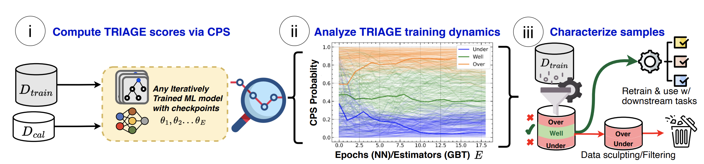

# TRIAGE: Characterizing and auditing training data for improved regression
[]()
[](https://github.com/seedatnabeel/TRIAGE/blob/main/LICENSE)



This repository contains the implementation of TRIAGE, a "Data-Centric AI" framework for data characterization tailored for regression.

TRIAGE can be used to characterize data using ***any*** machine learning regressor trained iteratively. We provide an interface for using TRIAGE, which can be used with **Pytorch models**, as well as, **SKLearn style API models** including *XGBoost, LightGBM and CatBoost*.

The utility of TRIAGE extends to a variety of use-cases.

For more details, please read our [NeurIPS 2023 paper](https://arxiv.org/): *TRIAGE: Characterizing and auditing training data for improved regression*.

---

# Installation
1. Clone the repository
2. Create a new conda environment with Python 3.8. e.g:
```shell
    conda create --name triage_env python=3.8
```
3. With the venv activated, run the following command from the repository directory:

- Minimum requirements to run TRIAGE on your own data
 ```shell
pip install -r requirements-min.txt
 ```
or for all
 ```shell
pip install -r requirements.txt
 ```

4. Link the venv to the kernel:
```shell
 python -m ipykernel install --user --name=triage_env
 ```

----
# Getting started

## TRIAGE on your own data with 2-lines of code added to your training loops!

To get started with TRIAGE on your own data, we provide tutorial notebooks to illustrate the usage of TRIAGE. Examples are provided for both Pytorch and SKLearn (XGBoost, Catboost, LightGBM) models/regressors.

These notebooks can be found in the ``/tutorials`` folder. We use an open-source dataset from OpenML as an example dataset in the tutorials for ease of accessbility.

1. ``tutorial_torch.ipynb``

 - Example integration of TRIAGE with Pytorch models

2. ``tutorial_sklearn.ipynb``

- Example integration of TRIAGE with SKLearn style models trained iteratively (e.g. XGBoost, LigthGBM, CatBoost)

3. ``tutorial_torch_dataloader.ipynb``

 - Example integration of TRIAGE with Pytorch models using the dataloader of Pytorch

----

# Use-cases

We highlight different use-cases of TRIAGE in notebooks which can be found in the ``/use_cases`` folder.


---
# Citing

If you use this code, please cite the associated paper:

```
@inproceedings
{seedat2023triage,
title={TRIAGE: Characterizing and auditing training data for improved regression},
author={Seedat, Nabeel and Crabbe, Jonathan and Qian, Zhaozhi and van der Schaar, Mihaela},
booktitle={Thirty-seventh Conference on Neural Information Processing Systems},
year={2023}
}
```
